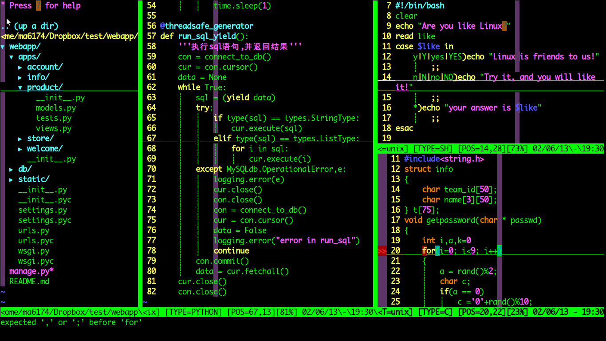

# 超强vim配置文件

[](https://travis-ci.org/ma6174/vim)

### 运行截图



### 简易安装方法：

打开终端，将下面的命令保存为shell搅拌，然后执行就自动安装好了：
```sh
#!/bin/bash
echo "安装将花费一定时间，请耐心等待直到安装完成^_^"
if which apt-get >/dev/null; then
	sudo apt-get install -y vim vim-gnome ctags xclip astyle python-setuptools python-dev git
elif which yum >/dev/null; then
	sudo yum install -y gcc vim git ctags xclip astyle python-setuptools python-devel	
fi

##Add HomeBrew support on  Mac OS
if which brew >/dev/null;then
    echo "You are using HomeBrew tool"
    brew install vim ctags git astyle
fi

sudo easy_install -ZU autopep8
sudo ln -s /usr/bin/ctags /usr/local/bin/ctags
mv -f ~/vim ~/vim_old
cd ~/ && git clone https://github.com/ma6174/vim.git
mv -f ~/.vim ~/.vim_old
mv -f ~/vim ~/.vim
mv -f ~/.vimrc ~/.vimrc_old
mv -f ~/.vim/.vimrc ~/
git clone https://git.oschina.net/bearxup/vim.git ~/.vim/bundle/vundle
echo "ma6174正在努力为您安装bundle程序" > ma6174
echo "安装完毕将自动退出" >> ma6174
echo "请耐心等待" >> ma6174
vim ma6174 -c "BundleInstall" -c "q" -c "q"
rm ma6174
echo "安装完成"
```

### 或者自己手动安装：(以ubuntu为例)

1. 安装vim `sudo apt-get install vim`
- 安装ctags：`sudo apt-get install ctags`
- 安装一些必备程序：`sudo apt-get install xclip vim-gnome astyle python-setuptools`
- python代码格式化工具：`sudo easy_install -ZU autopep8`
- `sudo ln -s /usr/bin/ctags /usr/local/bin/ctags`
- clone配置文件：`cd ~/ && git clone https://git.oschina.net/bearxup/vim.git
- `mv ~/vim ~/.vim`
- `mv ~/.vim/.vimrc ~/`
- clone bundle 程序：`git clone https://git.oschina.net/bearxup/vundle.git ~/.vim/bundle/vundle`
- 打开vim并执行bundle程序`:BundleInstall`
- 重新打开vim即可看到效果

### 了解更多vim使用的小技巧：

[tips.md](tips.md)

### 查看更新日志：

[`update_log.md`](update_log.md)
